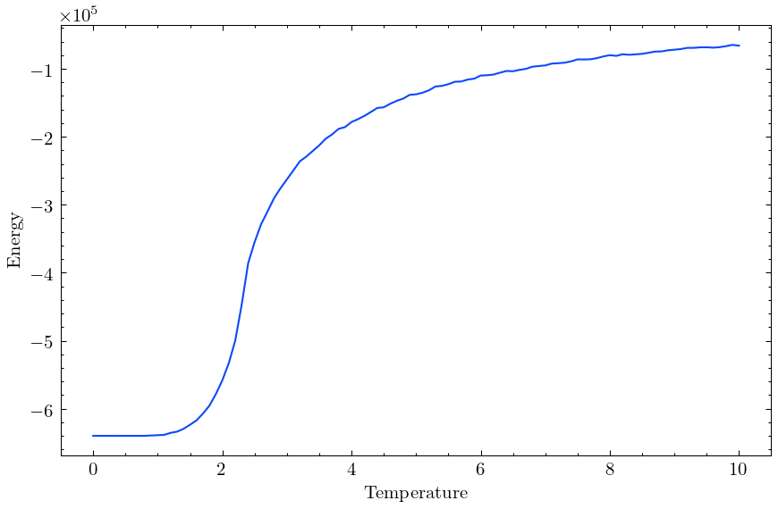
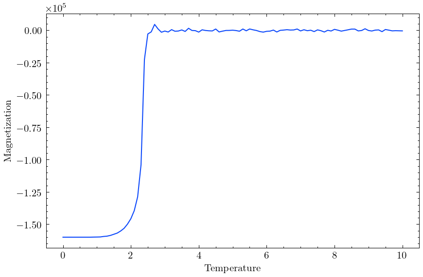
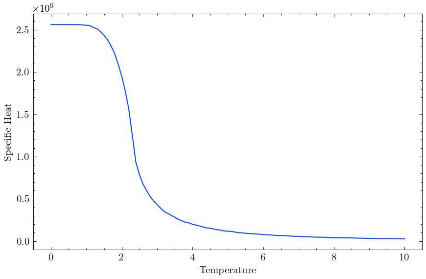
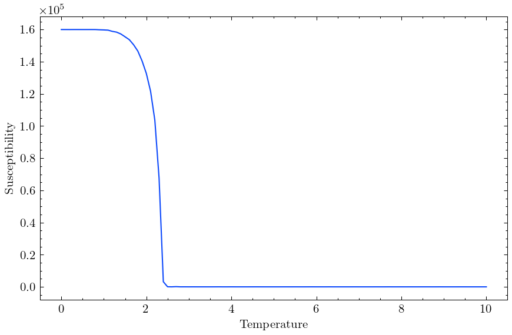

# Ising model in 2D and 3D.

## Ising 2D
Grid size = 1000x1000

### Temperature = 0.5

---

### Temperature = 2.0

---

### Temperature = 2.5

---

### Temperature = 5.0

---

## Plots

### Energy

### Magnetization

### Specific Heat

### Susceptibility

